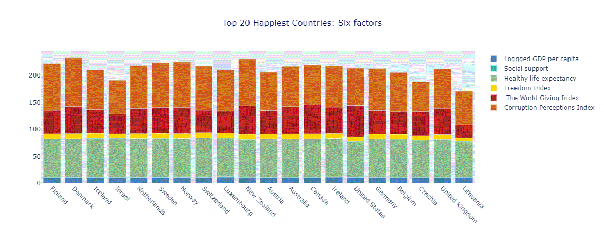

# Country Happiness Ranking Research
 
## Overview

The project "Country Happiness Ranking Research" is aimed at identifying factors that influence the level of happiness of the population in different countries and understanding the dynamics of this phenomenon over time. By analyzing various social, economic, cultural and political factors, the project aims to identify the key influential variables that determine the level of happiness of countries. Based on the data and results of the study, recommendations can be developed to improve social policy, economic development and other areas aimed at improving the quality of life of the population and creating favorable conditions for its development. 

# Milestone 1: 
## Identification of the problem

### **Research questions**:
*	What factors are most correlated with the overall level of happiness in countries?
*	Is there a link between economic indicators (e.g., GDP per capita) and happiness?
*	Is there a relationship between social indicators (e.g., trust) and happiness?
*	What is the impact of quality of life (e.g., access to education and health care) on overall happiness?
*	Is it possible to predict the level of happiness of countries using machine learning models based on various factors?

Researching these questions can help to better understand what factors influence the happiness of the population of countries and how this knowledge can be used to improve the quality of life.

## The main purposes and uses of Country Happiness Ranking Research include:

* **Assessment of the quality of life**: Happiness rankings allow us to assess the overall level of life satisfaction and happiness of the population in different countries.This is important for understanding how satisfied people are with their lives and what factors affect their well-being.

* **Comparison between countries**: Happiness rankings allow you to compare the level of happiness and well-being between different countries. This can help identify differences in living conditions, economic conditions, social policies, and other factors between countries.

* **Assessing the impact of policies and programs**: Happiness rankings can serve as an indicator of the effectiveness of social programs, economic policies and other initiatives in the area of well-being and life satisfaction. It helps to identify which measures lead to to improve the quality of life and happiness of the population.

* **Development of improvement strategies**: Analyzing happiness rankings can help develop strategies and programs to improve quality of life and life satisfaction in different countries. It allows to identify key aspects that should be improved to achieve higher levels of well-being.

# Milestone 2: 

## Data Collection

### Non-Technical Explanation of Domain Modeling

This project presents an analysis of the data collected to assess the happiness ranking in different countries of the world. The collected dataset is the result of an in-depth research analysis, which included a thorough search and study of data from various authoritative sources. Thanks to a thorough approach to data collection, the dataset is of high quality, which significantly reduces the need for additional cleaning and preparation.
In this project, domain modeling is like creating a map to help us navigate the complex landscape of global happiness levels. It's a visual guide, like a map, that helps us understand how economic prosperity, social support systems, health indicators, and personal freedoms influence the happiness of people in different parts of the world.

###  `Data Collection and Cleaning Scripts`

* **Data collection process**
To ensure the high quality and reliability of the data, a comprehensive research analysis was conducted, which included the following steps:

* **Identification of reliable data sources**

Only reputable sources such as international organizations, governmental and non-governmental reports were used.
Ratings and indices that assess the level of happiness in different countries were taken into account.

* **Thorough search and collection of data**

An in-depth data search was conducted to obtain the most relevant and reliable information.
Data were collected from a variety of sources to ensure completeness and comprehensive analysis.

* **Data verification for consistency and accuracy**

Data was verified to ensure its accuracy.
All collected data was cross-checked with several sources to identify and eliminate possible errors.

For transparency and replication, I provide all scripts for data collection and cleaning, covering the entire process, including data partitioning.

### `Research Work`
I conducted an extensive data search and compiled the information meticulously. My dataset is the result of thorough and comprehensive research efforts. Engaged in Data Science research, I focus on identifying deep patterns and trends that shed light on what makes people happy around the world. Through rigorous analysis and innovative approaches, I aim to make a significant contribution to understanding and promoting happiness around the world.

 

**_Be aware that the full description of this milestone you can find by refer to [README](./milestone/milestone_2/README.md)_**

# Milestone 3: 

## [Data Analysis](./milestone/milestone_3)

**_Be aware that the full description of this milestone you can find by refer to [README](./milestone/milestone_3/README.md)_**

### `Non-technical explanation of our findings`

This analysis of the Country Happiness Ranking Research dataset revealed significant insights into the factors that influence happiness across various countries. By examining economic, social, and institutional indicators, I observed how these variables impact the overall happiness and well-being of populations globally.

### `Key Findings`

The overall model explain a significant proportion of the variance (R-squared = 0.798) and the  model generalizes well to new data, as the R^2 on the test data (0.8119) and the R^2 on the training data (0.7898) are very close to each other. This indicates that the model is not overfitted and has good predictive power.

### `Technical description of analysis`

Results of the data analysis conducted using Jupyter Notebook can be found [**here**](/milestone/milestone_3/analysis.ipynb).

### `Technical explanation of findings`

    The analysis was done in Python.

1. **Country Happiness Ranking Analysis:**

   - **Social support** and **GDP per capita** are the most important factors in this model, emphasizing the importance of social ties and support for well-being.

   - **The happiest countries** are mostly located in Europe. Finland, Denmark, Iceland, the Netherlands, Sweden, Norway, Switzerland, and Luxembourg are all located in Europe.

   Israel, also among the happiest countries, is located in the Middle East.

   - **The least happy countries** are mostly located in Africa. These are Afghanistan, Lebanon, Sierra Leone, Zimbabwe, Congo (Kinshasa), Botswana, Malawi, Comoros, Tanzania and Zambia.

   Afghanistan and Lebanon are located in Asia, which indicates that regional conflicts and political instability can have a significant impact on the level of happiness of the population.

2. **Relationship Between Economic Prosperity and Ladder score:**
   - Countries with higher Logged GDP per capita also have high Ladder scores, which indicates a correlation between economic well-being and happiness. For example, Luxembourg (Logged GDP per capita = 11,660) has a Ladder score of 7.228, and Denmark (Logged GDP per capita = 10,962) has a Ladder score of 7.586. However, there are exceptions where countries with relatively high Logged GDP per capita have lower happiness scores, for example, Singapore (Logged GDP per capita = 11,571) has a Ladder score of 6.587, which is lower than some other rich countries.

   - The poorest countries tend to have very low Ladder scores, indicating that economic hardship can have a strong impact on overall happiness. For example, Afghanistan (Logged GDP per capita = 7.324) has the lowest Ladder score of 1.859.
   However, some poor countries, such as Mozambique (Logged GDP per capita = 7.116) with a Ladder score of 4.954, show that even with a low economic level, there may be other factors that support a relatively high level of happiness.

3.  **The relationship between social support and happiness**:

    - **High level of social support:**

    All of the countries in the top 10 by Ladder Score have a high level of social support. The values of social support for these countries are in a narrow range from 0.879 to 0.983, indicating that high levels of social support are one of the key factors contributing to high levels of happiness.

    The high values of social support in countries with high levels of happiness confirm the correlation between these two indicators. This means that people in countries with high levels of social support feel happier.

    - **Distribution of happiness and social support**:

    The countries with the highest happiness scores (Finland, Denmark, Iceland) also have some of the highest social support scores. This suggests that social support is an important factor in achieving high levels of happiness.

    - **Comparison between countries**:

     Finland, which has the highest level of happiness (7.804), also has a high level of social support (0.969). This reflects the general trend that countries with high levels of happiness provide their citizens with a high level of social support.

     Luxembourg has the lowest level of social support among the top 10 countries (0.879), but is still among the happiest countries. This may indicate that while social support is an important factor, other aspects such as economic development and freedom also have a significant impact on happiness.
   
# Milestone 4: 

## Insights:

* **Six out of the ten happiest countries in the world** according to the Happiness Index **are Scandinavian countries in Europe**, while **eight out of the ten least happy countries are located in Africa**. This suggests that the strong social welfare systems in the Nordic countries, which provide citizens with comprehensive support, access to healthcare, education, and other social services, contribute to a sense of security and well-being.

* **Luxembourg ranks first in terms of GDP per capita**. It is one of the richest countries in the world with a highly developed and diversified economy. A strong financial sector, favorable tax policies, and strategic location in Europe contribute to its high GDP per capita. The country also enjoys a high standard of living, well-developed infrastructure and relatively low unemployment. The GDP per capita indicator is based on the idea that economic prosperity and material wealth can contribute to the overall happiness of people to a certain extent. In general, a higher GDP per capita provides citizens with greater access to resources, healthcare, education, and other essential services, which has a positive impact on their well-being and life satisfaction. It can be argued that countries in the top ten in terms of GDP per capita take the well-being of their citizens seriously, which has a major impact on their level of happiness.

* **The Index of Freedom** is one of the key factors for assessing the level of happiness of people in different countries. It is an important aspect of well-being because it reflects the extent to which people have the autonomy and freedom to shape their lives according to their preferences, values, and aspirations. Countries that have a high level of freedom of life choices tend to have happier populations, as people are able to pursue their goals and live according to their values without undue constraints. This sense of self-determination can lead to higher levels of life satisfaction and overall well-being. According to this indicator, Finland ranks first among the countries with the highest freedom of life choices.

* **The healthy life expectancy** indicator goes beyond simply measuring life expectancy (which takes into account average life expectancy). It takes into account the quality of life during those years. Healthy life expectancy reflects the overall health of a population and how well people can enjoy their lives in terms of physical and mental health. **The top 4 countries in this indicator are dominated by Asian countries**, and it is widely known that these countries have the largest number of elderly people, which also shows how seriously their governments take the physical and mental well-being of their citizens. When people can enjoy a healthy and fulfilling life, it has a positive impact on their overall sense of well-being and life satisfaction.

* **The World Giving Index** is an important aspect of social well-being and community cohesion. When people engage in acts of kindness and generosity, it fosters a sense of trust, social support, and positive social interactions in society. Generosity is often seen as a reflection of the social fabric of a society. Countries with higher levels of generosity tend to have stronger social ties, a sense of community, and greater trust between people. These social factors play a crucial role in shaping happiness and well-being at the individual and societal levels.

* **The perception of corruption** is an important factor in assessing the happiness and well-being of the population in different countries.  It reflects the extent to which people believe corruption is prevalent in their society, government and institutions. Corruption is generally defined as the abuse of entrusted power for private gain. It can take many forms, such as bribery, embezzlement, nepotism, and favoritism. When corruption is widespread, it can undermine public trust, weaken the rule of law, and impede economic and social development. Perceptions of corruption are often measured through surveys and assessments that ask people about the level of corruption in their country or their personal experiences with corruption. Countries with lower levels of perceived corruption tend to rank higher in happiness rankings, as corruption can have several negative impacts on well-being. By incorporating perceptions of corruption into happiness reports, policymakers and researchers gain insight into the broader social and institutional factors that influence happiness and well-being. Countries that actively fight corruption and strive for greater transparency and accountability tend to create an environment that fosters trust, justice, and social stability, which positively impacts the overall happiness of their citizens.

### `Recommendations`
Each country has unique circumstances that may affect happiness, and understanding these contexts is key to drawing meaningful conclusions. It is important to be aware of the limitations of the data and analysis and to avoid overgeneralized or causal conclusions without further supporting evidence. The Ladder Score is a complex construct influenced by numerous factors, and no single study can capture the full complexity of human well-being. However, based on the analysis, government policies can potentially improve happiness and well-being in countries with lower levels of happiness. Countries with low levels of happiness can study successful policies from countries with higher happiness scores and explore the possibility of transferring them. The level of corruption in a country can be assessed by the prevalence of corruption in the government, and this can also affect the level of happiness of citizens. Happiness depends on various factors other than income, such as social support, health, freedom, and perceptions of corruption. These factors can play a significant role in determining happiness, even in countries with high GDP per capita.

### `Key Questions and Aspects for Consideration `

  1.	Why is Social Support so Influential?: Further research is needed to explore why social support has such a significant impact on happiness compared to other factors. Is it cultural, systemic, or related to public policy?

  2.	Economic Disparities: How do economic inequalities within countries affect overall happiness? Are there policies that can mitigate negative impacts?

  3.	Freedom and Policy Implications: Given the positive correlation between freedom and happiness, what specific freedoms (political, economic, personal) contribute most significantly to happiness?

 4.	Health and Happiness: Despite the limited direct impact observed, health is undoubtedly important. What other indirect ways might health influence happiness that our model didn't capture?

 5.	Generosity and Corruption: What initiatives can countries undertake to increase generosity and reduce corruption, thereby potentially boosting national happiness?

 6.	Data Limitations: Consider the limitations of the data used. Are there factors not included in the dataset that could provide additional insights into happiness?

By addressing these key questions and aspects for consideration, future studies can build on our findings to develop a more comprehensive understanding of what drives happiness on a global scale. Our analysis provides a foundational understanding, but ongoing research and data collection are essential to refine these insights and translate them into effective policies and practices.

